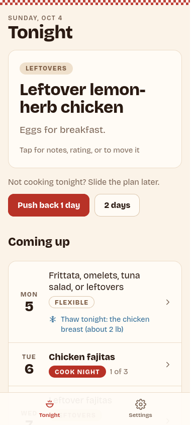
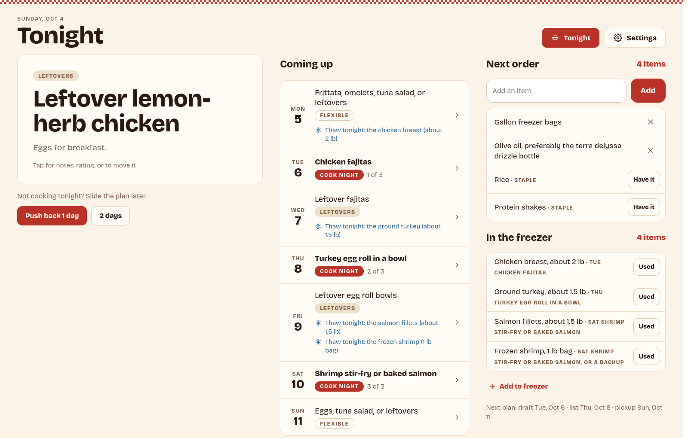
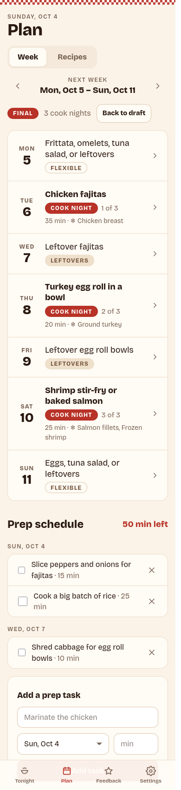
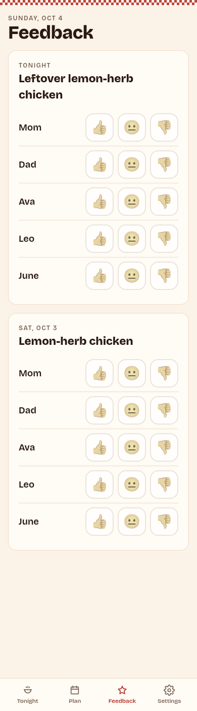

# MenuPlanner

A self-hosted family meal planner, built to be used mostly from a phone. Everyone in the household gets their own login and shares one plan.

> **Status:** early development. Planning works end to end in the app: recipes, the weekly plan and prep schedule, the Tonight screen, family feedback, and the kitchen display. Still to come: building the shopping list from the plan and pushing it to GroceryList, and AI planning through Claude Code / Codex. This README is updated with each release.

<p>
  
  &nbsp;
  
</p>
<p>
  
  &nbsp;
  
</p>

<sub>Screenshots use the demo data from <code>bun run seed:demo</code>.</sub>

## Features

### Tonight (home screen)

Modeled on a kitchen dashboard. On a phone the sections stack in one column; on a tablet they use two columns; on a desktop they sit side by side in three.

- **Tonight's meal:**
  - A big card showing the meal's kind (**Cook night** with "1 of 3", **Leftovers**, or **Flexible**), its title, and a side note like "Eggs for breakfast."
  - Tap it to open a sheet where you can rate the meal (1–5 stars), add notes, or move it to another day. If another meal is planned on that day, the two swap.
- **"Not cooking tonight? Slide the plan later":** **Push back 1 day** or **2 days** moves tonight's meal, every later meal, and any unfinished prep tasks later. Thaw reminders move with their meals.
- **Coming up:** the next seven days, each with its meal and kind pill. Days that need something thawed show a blue ❄ "Thaw tonight: the chicken breast (about 2 lb)" the evening before the meal that uses it.
- **Next order:**
  - Quick-add an item, or ✕ one off the list.
  - **Staples** (rice, protein shakes…) appear in every order with a **Have it** button for when you're still stocked. Items you mark this way stay off the list until the order is sent.
- **In the freezer:**
  - Inventory, with the meal each item is set aside for, or "or a backup".
  - Tap **Used** once something comes out.
  - **Add to freezer** opens a sheet where you can link the item to an upcoming meal.
- **Shopping rhythm:** the footer reads "Next plan: draft Tue, Oct 6 · list Thu, Oct 8 · pickup Sun, Oct 11", and you set the days in Settings.
- **Fast on a phone:**
  - The whole screen comes from one request.
  - Taps such as Have it, Used, Push back and adding an item update the screen immediately, and are undone if the server rejects them.
  - "Today" follows the phone's calendar and rolls over at midnight.

### Plan

- **Week view:**
  - Shows Monday through Sunday, with ‹ › to move between weeks. The week is labeled "This week" or "Next week" when it is one.
  - Each day shows its meal, kind pill, cook-night number, total recipe time, side note and any linked freezer items.
  - A plan is a **Draft** until you **Mark final**.
- **Editing a day:** tap the day to open a sheet where you can:
  - choose **Cook night**, **Leftovers** or **Flexible**
  - pick a recipe or just type a title ("Frittata, omelets, tuna salad, or leftovers")
  - for leftovers, choose which cook night they come from; the title is filled in as "Leftover …"
  - add a side note
  - tick the freezer items to thaw for it
  - **Clear day** removes the meal.

  Editing a day updates the existing meal, so its ratings and freezer links are kept.
- **Prep schedule:**
  - Batch-prep tasks for the week, including the Sunday before it ("Slice peppers and onions · 15 min").
  - Tasks are grouped by day with checkboxes, and the total minutes left is shown.
  - Push back moves unfinished tasks along with the meals.

### Recipes (Plan → Recipes)

- **Library:**
  - Search by title, description or tag.
  - Filter with **Kid-friendly** and tag chips.
  - Each card shows total time, servings, ingredient count, rating and tags.
- **Recipe page:**
  - A servings stepper scales every ingredient amount (shown as kitchen fractions).
  - Also shows prep-ahead notes, instructions, and the source link.
- **Editor:**
  - On a phone, each ingredient row has the name on its own line, with amount, unit and note below; on wider screens it's one line.
  - Amounts can be typed as `2`, `1.5`, `1/2`, `1 1/2` or `1½`.
  - Deleting a recipe keeps any planned meals that used it, by title.

### Feedback

- **Ratings:** each meal from the last ten days gets a row per family member with big 👍 😐 👎 buttons that kids can use. Tap the same button again to clear it.
- **Prerequisite:** family members are set up in Settings.

### Kitchen display

- **Full screen** (`/kiosk`, linked from the header on tablet and desktop, and from Settings): the Tonight screen without navigation, with larger type.
  - It refreshes every minute and has a Full screen toggle wherever the browser supports one.
  - On an iPhone, adding the app to the home screen already gives a full-screen view.

### Settings

- **Family:** everyone the plan feeds, kids included. For each person you can record whether they're a kid, plus likes, dislikes, allergies and notes.
- **Staples:** add or remove staples, and choose whether each one goes into every order.
- **Shopping rhythm:** the days you draft the plan, send the list, and pick up groceries.
- **Your account:** display name and password.
- **Family logins** (admins only): see below.

### Accounts & security

- **Separate logins, shared household data.**
  - The first account is created through a one-time setup screen protected by `BOOTSTRAP_TOKEN`, and it becomes the admin.
  - Admins add the rest of the family's logins, promote or demote admins, sign users out everywhere, and delete accounts. The last remaining admin can't be deleted.
- **Account settings:** change your display name or password. Changing your password signs out your other devices.
- **Phone-first, installable app (PWA):**
  - On phones, navigation is a bottom tab bar that respects iPhone safe areas; from tablet width up it moves to pill buttons in the header.
  - "Add to Home Screen" works on iOS and Android, with icons and a standalone display.
  - A service worker caches the app shell so it opens quickly.
- **Security:**
  - Passwords are hashed with Argon2id.
  - Failed logins and setup attempts are rate-limited, and a login for an unknown username takes as long as one for a real account.
  - Login tokens are revocable: logging out revokes that session, and admins can revoke all of a user's sessions.
  - The server refuses to start with a weak or placeholder `JWT_SECRET`.
  - nginx serves a strict CSP (all fonts and scripts are first-party) and HSTS.

## Tech stack

| Layer | Technology |
|-------|-----------|
| Runtime / package manager | [Bun](https://bun.sh) workspaces |
| Backend | [Hono](https://hono.dev) + [tRPC](https://trpc.io) 11, [zod](https://zod.dev) validation |
| Database | SQLite via `bun:sqlite` + [Drizzle ORM](https://orm.drizzle.team) |
| Auth | Argon2id (`Bun.password`), HS256 JWTs via [jose](https://github.com/panva/jose) |
| Frontend | React 19, React Router 7, TanStack Query, Vite 6, plain CSS |
| Fonts | Bricolage Grotesque, self-hosted via `@fontsource` |
| Serving | nginx (static files + `/api` proxy), Docker Compose, optional Cloudflare Tunnel |

## Project layout

```
apps/
  backend/            Hono + tRPC API server
    src/
      index.ts        Entry point: config checks, migrations, server
      app.ts          HTTP routes (/api/trpc/*, /health)
      router.ts       tRPC router
      routers/        auth, users, tonight, plans, recipes, family, feedback, shopping, freezer, staples, settings
      services/       plans.ts (save/edit a week, push back, move), recipes.ts, order.ts (next-order rules)
      db/             schema.ts (Drizzle), migrate.ts (idempotent SQL run at boot)
      lib/            jwt, rate limiting, input limits, secret helpers
    scripts/          seed-demo.ts
    tests/            bun:test suites
    Dockerfile
  frontend/           React SPA
    src/
      routes/         Tonight, Kiosk, Plan, Recipes, Recipe, RecipeEdit, Feedback, Settings, Login, Setup
      components/     AppShell (header + tab bar), BottomSheet, MealPills, PlanTabs, Icon, ProtectedRoute
      hooks/ lib/     auth, tRPC client, session storage
      index.css       Design tokens + phone-first styles
    public/           manifest.json, sw.js, icons
    nginx.conf, security-headers.conf, Dockerfile
packages/
  shared/             @menu/shared — pure TypeScript used by backend, frontend and CLI
    src/
      ingredients.ts  Combine a week's ingredients; unit conversion; kitchen formatting
      dates.ts        Local-calendar date helpers, Monday week starts, "push back" shifting
      plan.ts         Cook-night numbering ("1 of 3"), thaw-tonight reminders
      schemas.ts      zod schemas for recipes and weekly plans
      types.ts, limits.ts
    tests/
docker-compose.yml
.env.example
```

### Shared planning logic

`@menu/shared` has no I/O and is unit-tested on its own:

- **Ingredient aggregation:**
  - Ingredient names are matched ignoring case, spacing and simple plurals, so "Yellow onions" and "yellow onion" are the same item.
  - Volumes (tsp/tbsp/cup/fl oz/pint/quart/gallon/ml/l) and masses (oz/lb/g/kg) are converted to a common base and summed. The total is shown in a readable unit: imperial if any input was imperial, otherwise metric.
  - Units that can't be converted (cans, cloves, bunches…) are summed per unit and listed side by side, e.g. "8 oz + 2 cans".
  - Amounts use kitchen fractions (1½, ⅓). An amount that doesn't fit a measuring cup, like ⅜ cup, is shown in spoons instead: 6 tbsp. `parseQty()` reads typed amounts such as "1 1/2" or "½".
  - Each combined item records which meals it came from.
- **Dates:** plans use plain `YYYY-MM-DD` dates in the household's local calendar, and weeks run Monday to Sunday. "Push back" moves tonight's meal and every later one by N days.
- **Plan helpers:** cook nights are numbered in date order. A freezer item linked to a meal produces a "Thaw tonight" reminder the evening before.
- **Schemas:** the zod input schemas for recipes and weekly plans. The API and the agent CLI will both validate against these.

## Running with Docker Compose

1. Copy `.env.example` to `.env` and fill in:
   - `JWT_SECRET`: required, at least 32 characters. Generate it with `openssl rand -base64 48`.
   - `BOOTSTRAP_TOKEN`: needed once, to create the first account. Generate it with `openssl rand -base64 24`.
   - `APP_UID` / `APP_GID`: optional. Set these to the owner of the data directory (`id -u` / `id -g`).
2. Start the app:

   ```bash
   mkdir -p data
   docker compose up -d --build
   ```

3. Open `http://localhost:3010`. Change the port with `MENU_PORT`; it's bound to `127.0.0.1` only. On a fresh database you're sent to **Set up MenuPlanner**: enter the `BOOTSTRAP_TOKEN` value to create the admin account. After that, add your family's logins under **Settings → Family logins**.

The SQLite database is stored in `./data/menu.sqlite`. Change the location with `DATA_PATH`.

### Cloudflare Tunnel (optional)

The `cloudflared` service only runs under the `tunnel` profile:

```bash
docker compose --profile tunnel up -d --build
```

Set `CLOUDFLARE_TUNNEL_TOKEN` in `.env`, and in the Cloudflare dashboard point the tunnel's public hostname at `http://menu-frontend:80`. nginx sends HSTS unconditionally because TLS is terminated at Cloudflare.

### Installing on a phone

Open the site over HTTPS (for example through the tunnel) and add it to the home screen. On iOS, use **Share → Add to Home Screen**; on Android, use **Install app**. It then opens full-screen like a native app.

## Configuration

| Variable | Required | Default | Description |
|----------|----------|---------|-------------|
| `JWT_SECRET` | Yes | — | Signs login tokens. At least 32 characters, not a placeholder |
| `BOOTSTRAP_TOKEN` | For first-run setup | — | Must be entered to create the first (admin) account. Setup is closed permanently once any account exists |
| `DATABASE_URL` | No | in-memory | SQLite file path. Compose sets `/data/menu.sqlite`. Without it, nothing is saved |
| `PORT` | No | `3001` | Backend listen port |
| `MENU_PORT` | No | `3010` | Host port for the web UI (Compose) |
| `DATA_PATH` | No | `./data` | Host directory for the database (Compose) |
| `APP_UID` / `APP_GID` | No | `1000` | User the backend container runs as (Compose) |
| `CLOUDFLARE_TUNNEL_TOKEN` | With `--profile tunnel` | — | Cloudflare Tunnel connector token |

## Development

Requires Bun 1.3+.

```bash
bun install

# Terminal 1 — API on :3001
JWT_SECRET=$(openssl rand -base64 48) BOOTSTRAP_TOKEN=dev DATABASE_URL=./dev.sqlite bun run dev:backend

# Terminal 2 — Vite on :5173, proxying /api to :3001
bun run dev:frontend
```

| Command | What it does |
|---------|--------------|
| `bun run test` | `bun test` for `@menu/shared` and the backend (tRPC procedures run in-process against in-memory SQLite) |
| `bun run typecheck` | `tsc --noEmit` in every workspace |
| `bun run build` | Production frontend build into `apps/frontend/dist` |
| `DATABASE_URL=./dev.sqlite bun run seed:demo` | Fills an **empty** database with a sample week (dated relative to today), recipes, a family of five, prep tasks, freezer items, staples and a couple of order items, so you can try the app. Refuses to run if any plan already exists |

GitHub Actions (`.github/workflows/ci.yml`) runs the typecheck, the tests, the frontend build, and both Docker image builds on every pull request.

Schema changes go in two places that must stay in step: `apps/backend/src/db/schema.ts` (Drizzle types) and `apps/backend/src/db/migrate.ts` (the idempotent SQL that actually creates tables at boot).

## License

[GNU General Public License v3.0](LICENSE)
